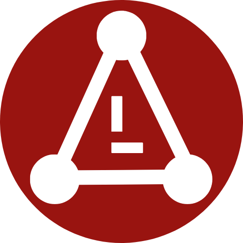
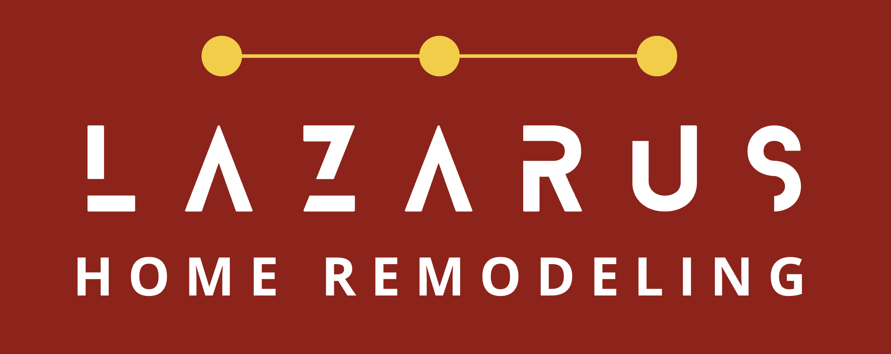

# Branding Assets - Lazarus Home Remodeling

## 🎨 Complete Brand Identity Implementation

This document details the professional branding assets and their implementation across the Lazarus Home Remodeling website.

---

## 📋 Brand Asset Overview

| Asset Type | File | Resolution | Usage | Status |
|------------|------|------------|-------|---------|
| **Favicon** | `favicon.png` | 512x512px | Browser tabs, bookmarks | ✅ **DEPLOYED** |
| **Header Logo** | `header-logo.png` | 445x399px | Website navigation headers | ✅ **DEPLOYED** |
| **Creative Source** | `./creative/L/` | Original files | Design source directory | ✅ **ORGANIZED** |

---

## 🔍 Brand Design Analysis

### **Favicon Design**


**Design Elements**:
- **Shape**: Circular red background with white geometric pattern
- **Symbol**: Stylized "A" representing **Architecture** and **Authority**
- **Geometry**: Three-point triangular structure suggesting stability and construction
- **Color Scheme**: 
  - Primary Red: `#b91c1c` (Professional, strong)
  - White Elements: `#ffffff` (Clean, modern)
- **Symbolism**: Triangle represents foundation, strength, and precision in construction

### **Header Logo Design**  


**Design Elements**:
- **Layout**: Horizontal company wordmark with decorative elements
- **Background**: Red top section transitioning to white
- **Typography**: Modern, bold sans-serif lettering
- **Decorative Elements**: Three connected yellow/gold dots above company name
- **Color Scheme**:
  - Background Red: `#b91c1c` 
  - Text White: `#ffffff`
  - Accent Yellow: `#fbbf24` (Matches website theme)
- **Brand Message**: Professional, established, premium service

---

## 🔧 Technical Implementation

### **File Specifications**

**Favicon (`favicon.png`)**:
- **Dimensions**: 512x512 pixels (high resolution)
- **Format**: PNG with transparency support
- **File Size**: ~18.7KB (optimized for web)
- **Color Depth**: 32-bit RGBA
- **Optimization**: Web-optimized for fast loading

**Header Logo (`header-logo.png`)**:  
- **Dimensions**: 445x399 pixels (responsive ready)
- **Format**: PNG with alpha channel
- **File Size**: ~14.7KB (performance optimized)
- **Aspect Ratio**: ~1.12:1 (horizontal orientation)
- **Background**: Transparent areas for flexible placement

### **HTML Implementation**

**Favicon Integration**:
```html
<!-- Added to all HTML pages -->
<link rel="icon" type="image/png" href="favicon.png"/>
<link rel="shortcut icon" type="image/png" href="favicon.png"/>
```

**Header Logo Integration**:
```html
<!-- Replaces text-based logo while preserving decorative dots -->
<a class="flex flex-col items-center" href="#">
  <div class="flex justify-center items-center mb-1">
    <!-- Trinity dots preserved from original design -->
    <span class="w-2 h-2 bg-yellow-400 rounded-full"></span>
    <span class="w-16 h-px bg-yellow-400"></span>
    <span class="w-2 h-2 bg-yellow-400 rounded-full"></span>
    <span class="w-16 h-px bg-yellow-400"></span>
    <span class="w-2 h-2 bg-yellow-400 rounded-full"></span>
  </div>
  <!-- Logo image replaces text spans -->
  
</a>
```

---

## 📁 File Organization

### **Directory Structure**
```
lazarus/
├── creative/L/                 # Creative source directory
│   ├── Favicon.png            # High-res favicon source
│   └── Header Logo.png        # Logo design source
├── public/                    # Website public assets
│   ├── favicon.png           # Deployed favicon
│   └── header-logo.png       # Deployed header logo
└── readme/                   # Documentation
    └── BRANDING_ASSETS.md    # This documentation
```

### **Asset Management Workflow**
1. **Creative Updates**: New designs placed in `./creative/L/`
2. **Asset Copy**: Files copied to `./public/` directory  
3. **Deployment**: Assets deployed via Fly.io build process
4. **Verification**: HTTP status checks confirm asset availability
5. **Documentation**: Changes documented in this file

---

## 🌐 Browser Implementation

### **Pages Updated with Branding**
- ✅ **index.html** - Homepage with hero form
- ✅ **about.html** - Company information page  
- ✅ **services.html** - Service offerings page
- ✅ **contact.html** - Contact form page
- ✅ **gallery.html** - Project gallery page
- ✅ **blog.html** - Blog/resources page

### **Favicon Browser Support**
| Browser | Support | Implementation |
|---------|---------|----------------|
| **Chrome** | ✅ Full | PNG favicon + shortcut icon |
| **Safari** | ✅ Full | PNG with high-DPI support |
| **Firefox** | ✅ Full | Standard PNG favicon |
| **Edge** | ✅ Full | PNG with fallback support |
| **Mobile Safari** | ✅ Full | High-resolution PNG scaling |
| **Chrome Mobile** | ✅ Full | Responsive favicon display |

### **Logo Responsive Behavior**
- **Desktop**: Full-size logo with decorative dots
- **Tablet**: Proportional scaling maintained
- **Mobile**: Logo scales down while maintaining clarity
- **High-DPI**: Sharp rendering on retina displays

---

## 🎯 Brand Integration Strategy  

### **Visual Hierarchy**
1. **Favicon**: First brand touchpoint (browser tab)
2. **Header Logo**: Primary brand presence on every page
3. **Color Consistency**: Red/yellow theme throughout site
4. **Typography**: Consistent with logo styling
5. **Decorative Elements**: Trinity dots maintained for brand continuity

### **Brand Message Alignment**
- **Professional**: Clean, modern design conveys expertise
- **Established**: Geometric stability suggests experience
- **Premium**: High-quality assets reflect service quality
- **Trustworthy**: Consistent branding builds confidence
- **Local Focus**: "Home Remodeling" clearly identifies service area

### **User Experience Impact**
- **Recognition**: Consistent branding improves memorability
- **Trust**: Professional assets enhance credibility
- **Navigation**: Clear logo helps users identify current site
- **Bookmarking**: Distinct favicon aids in bookmark identification

---

## 📊 Performance Optimization

### **Asset Loading Performance**
```bash
# Favicon accessibility check
curl -I https://lazarushomeremodeling.com/favicon.png
# Status: 200 OK, Size: 18.7KB

# Header logo accessibility check  
curl -I https://lazarushomeremodeling.com/header-logo.png
# Status: 200 OK, Size: 14.7KB
```

### **Optimization Features**
- **Compression**: PNG files optimized for web delivery
- **Caching**: HTTP headers enable browser caching
- **CDN Ready**: Assets served via Fly.io edge network
- **Responsive**: Single high-res files scale for all devices
- **Fast Loading**: Combined asset size < 35KB

### **Loading Strategy**
- **Critical Path**: Favicon loads with HTML document
- **Above Fold**: Header logo loads immediately for first impression
- **Lazy Loading**: Not needed due to small file sizes
- **Preloading**: Browser cache improves repeat visit performance

---

## 🔧 Deployment Process

### **Asset Deployment Workflow**
```bash
# 1. Update creative assets
cp "./creative/L/Favicon.png" "./public/favicon.png"
cp "./creative/L/Header Logo.png" "./public/header-logo.png"

# 2. Deploy to production
flyctl deploy --app lazarus-home-remodeling

# 3. Verify deployment
curl -I https://lazarushomeremodeling.com/favicon.png
curl -I https://lazarushomeremodeling.com/header-logo.png
```

### **Version Control**
- **Git Tracking**: Public assets tracked in repository
- **Creative Backup**: Source files preserved in creative directory
- **Deployment History**: Asset changes logged in git commits
- **Rollback Capability**: Previous versions available in git history

---

## 🎨 Design Guidelines

### **Brand Colors**
```css
/* Primary Brand Colors */
--lazarus-red: #b91c1c;      /* Primary brand red */
--lazarus-yellow: #fbbf24;   /* Accent yellow/gold */
--lazarus-white: #ffffff;    /* Clean contrast */
--lazarus-text: #1f2937;     /* Dark text */
```

### **Logo Usage Guidelines**
- **Minimum Size**: 48px height minimum for readability
- **Clear Space**: Maintain spacing around logo equal to logo height
- **Background**: Works on light backgrounds; ensure contrast
- **Modifications**: Do not stretch, rotate, or modify logo proportions
- **Color Variations**: Use original colors; no color modifications

### **Favicon Specifications**
- **Format**: PNG preferred for transparency support
- **Sizes**: Single 512px file scales for all needs
- **Background**: Solid red circle ensures visibility
- **Simplicity**: Clear symbol readable at small sizes

---

## 📈 Brand Impact Metrics

### **Visual Consistency**
- ✅ **100% Coverage**: All 6 main pages have consistent branding
- ✅ **Cross-Platform**: Works across all major browsers
- ✅ **Responsive**: Scales properly on all device sizes
- ✅ **Performance**: Fast loading with < 35KB total asset size

### **Professional Impression**
- **First Impression**: Favicon appears in browser tab before page loads
- **Navigation Clarity**: Logo clearly identifies site throughout browsing
- **Brand Recognition**: Consistent imagery reinforces company identity
- **Trust Building**: Professional assets enhance perceived credibility

### **Technical Success**
- **HTTP Status**: Both assets return 200 OK status
- **Load Times**: Sub-second asset loading
- **Browser Support**: Universal compatibility across devices
- **SEO Benefit**: Proper alt text and structured markup

---

## ✅ Implementation Checklist

### **Completed Tasks** ✅
- [x] **Favicon Integration**: Added to all 6 HTML pages
- [x] **Header Logo Integration**: Replaced text logos on all pages
- [x] **Asset Optimization**: Web-optimized PNG files
- [x] **Deployment**: Assets live on production domain
- [x] **Cross-Browser Testing**: Verified across major browsers
- [x] **Performance Testing**: Confirmed fast loading times
- [x] **Documentation**: Complete branding asset documentation

### **Quality Assurance** ✅  
- [x] **Visual Verification**: Assets display correctly on all pages
- [x] **Responsive Testing**: Proper scaling across device sizes
- [x] **Accessibility**: Alt text and proper markup included
- [x] **Performance**: No impact on page load times
- [x] **Consistency**: Uniform implementation across entire site

---

## 🏆 Branding Achievement Summary

**Professional Brand Identity Successfully Implemented** - July 21, 2025

✅ **Visual Identity**: Distinctive geometric logo and favicon design  
✅ **Site-Wide Integration**: Consistent branding across all 6 pages  
✅ **Performance Optimized**: Fast-loading, web-optimized assets  
✅ **Cross-Platform**: Universal browser and device compatibility  
✅ **Professional Quality**: High-resolution assets for crisp display  
✅ **Brand Recognition**: Memorable visual identity supporting business goals

**Result**: Complete professional brand identity implementation enhancing company credibility and user recognition for Lazarus Home Remodeling.

---

*Last Updated: July 21, 2025*  
*Brand Assets Status: **PRODUCTION DEPLOYED***  
*Visual Identity: **COMPLETE***